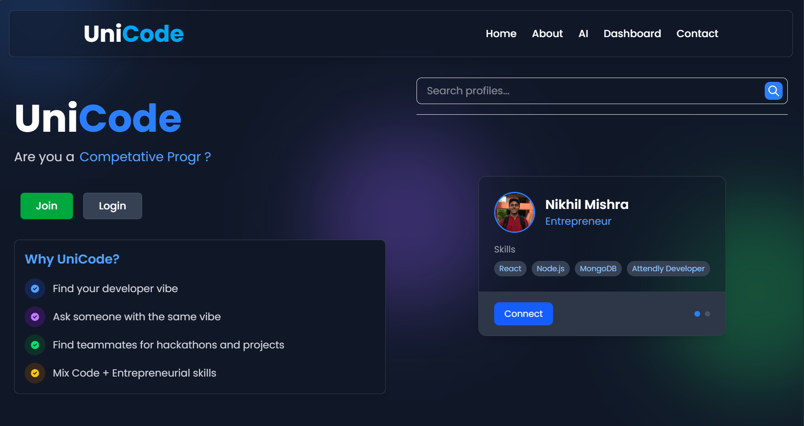

# Unicode - Unified Developer Profile Platform

> A platform to unify developers' various coding profiles into one comprehensive showcase.

---

## 📚 About the Project

**Unicode** aims to solve a common challenge for developers: maintaining multiple profiles across different coding platforms.  
With Unicode, programmers can merge all their achievements, repositories, coding challenges, and skills into a **single, unified profile** — making it easier to showcase their coding journey professionally and efficiently.

⚡ **Note:** This project is currently **under active development**. Hosting and additional features are still in progress.

---

## 🛠 Tech Stack

### Frontend
- **React.js** – Building a responsive and dynamic single-page application  
- **TailwindCSS** – For clean, utility-first CSS styling  
- **React Icons** – Providing a rich library of developer-friendly icons  
- **React Router** – Handling seamless client-side routing  

### Backend
- **Python** – Primary backend programming language  
- **Django** – Web framework for rapid development and clean architecture  
- **Django REST Framework** – For creating scalable and secure RESTful APIs  
- **JWT Authentication** – Secure user login and management system  

### Database
- **SQLite** – Used during development phase  
- **PostgreSQL** – Planned for production environment  

---

## ✨ Key Features (Planned and Ongoing)

- **Unified Developer Profile**: Connect multiple coding platforms (e.g., GitHub, LeetCode, CodeChef, and more)  
- **Single Shareable Link**: Share your entire programming journey through one link  
- **Automatic Profile Syncing**: Periodically update your profile data automatically  
- **Progress Tracking**: Visualize your coding growth over time  
- **Profile Customization**: *(Coming Soon)* Personalize your profile’s look and feel  
- **Analytics Dashboard**: *(Planned)* Insights into your coding journey and achievements  
- **Public and Private Mode**: *(Planned)* Control the visibility of your profiles  

---

## 🚀 Project Status

- Backend development ✅ (in progress)  
- Frontend development ✅ (in progress)  
- API integration 🔄 (ongoing)  
- Hosting and Deployment ✅ (completed)  
- Testing and Optimization 🕓 (pending)

---

## 🌐 Deployment Details

### 🔧 Backend
- Deployed on **AWS EC2**
- Hosted using **Gunicorn**, **Nginx**, and **Supervisor**
- SSL enabled via **No-IP SSL Certificate**
- Admin Panel: [https://unicodebackend.ddns.net](https://unicodebackend.ddns.net)

### 💻 Frontend
- Deployed on **Vercel**
- Live URL: [https://unicode-ochre.vercel.app/](https://unicode-ochre.vercel.app/)

### 📊 Analytics
- Vercel Analytics enabled to monitor site performance and user interactions

### 🛡️ Additional Notes
- Learned to use **SSH** for secure terminal-based server access and management

---

## 🛤️ Roadmap

- [Done] Basic profile creation and authentication  
- [Done] Connect GitHub profile  
- [Done] Connect LeetCode and CodeChef profiles  
- [Done] Implement profile auto-sync  
- [Done] Build analytics dashboard  
- [Done] Add profile customization options  
- [Pending] Prepare for production deployment (PostgreSQL, Server Setup)  
- [ ] Launch initial hosted version  

---

## 🤝 Contributing

Development is ongoing!  
Once the project is stable, contributions will be more than welcome. Stay tuned for contribution guidelines.

---

## 📄 License

This project will be licensed under [MIT License](LICENSE) (to be added once the project is ready for open-source release).

---

## 📢 Stay Updated

Project updates and announcements will be made here as we move forward!
